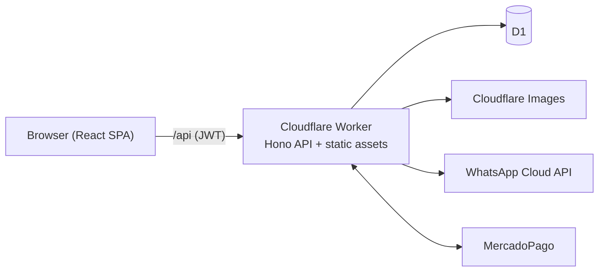

# Zona Atletismo — Event management webapp

Web platform for **[Zona Atletismo](https://zonaatletismo.com.ar)**, a running-event organizer
based in Villa Constitución, Santa Fe, Argentina. Organizers use it to publish races and manage
the whole event: registrations, payments, bibs, timing chips, t-shirts, kit delivery and
finances. Athletes and their coaches use it to sign up and pay online.

The UI is in Spanish (Argentina). The code and these docs are in English.

## Features

- **Athletes:**
  - Passwordless login with a WhatsApp one-time code.
  - Profile, then registration for a race circuit.
  - Payment with **MercadoPago** or bank transfer.
  - Their registration: category, bib, chip, shirt size, balance.
  - Two-person event teams.
- **Athletes managers (coaches):**
  - Manage their athletes.
  - Register and pay for many athletes at once.
- **Organizers:**
  - **Events:** circuits with bib ranges, schedule, regular and early-bird fees, discounts, drafts,
    cover photo.
  - **Registrations admin:** manual payments, discounts, waive, cancel, reactivate, transfer.
  - **Automatic assignment on payment:** bib number, timing chip and t-shirt from stock.
  - **Race-day tools:**
    - clothing stock dashboard;
    - kit delivery desk;
    - "find your bib" kiosk screen;
    - CSV export for the **Rufus** timing software.
  - Per-event ledger with balance and CSV.
  - Users, roles, bans, managers, locations, training teams and timing-chip segments.

## Stack

- **Cloudflare Workers:** one Worker serves the SPA assets and the API.
- **Cloudflare D1** (SQLite), with **Drizzle ORM** and drizzle-kit migrations.
- **Hono** API with JWT auth; **zod** schemas shared between API and UI.
- **React 19** + **Vite**, **TanStack Router / Form / Table**, **shadcn/ui** + **Tailwind CSS v4**.
- Integrations: **MercadoPago Checkout Pro**, **WhatsApp Cloud API** (OTP), **Cloudflare Images**.



## Quick start

```bash
npm install
cp .dev.vars.example .dev.vars        # Worker env vars: use .dev.vars, NOT .env
# create + seed the local D1 (full ordered list in docs/03-development.md)
./migrate.sh local drizzle/0000_needy_quentin_quire.sql
./migrate.sh local drizzle/0000_z_indexes.sql
./migrate.sh local drizzle/0000_z_initial_test_data.sql
# ...then 0001 → 0008 and 0008_z_indexes.sql, in order
npm run dev                            # http://localhost:5173
```

Login uses a WhatsApp code. To log in locally without WhatsApp, see
[docs/03-development.md](docs/03-development.md#5-logging-in-locally).

## Scripts

| Command | Description |
|---|---|
| `npm run dev` | Dev server (SPA + Worker + local D1) with HMR |
| `npm run build` | Type-check and build |
| `npm run lint` | ESLint |
| `npm run check` | Type-check, build and deploy dry-run |
| `npm run db:generate` | Generate a SQL migration from `src/worker/db/schema.ts` |
| `./migrate.sh local\|remote drizzle/<file>.sql` | Apply one migration and record it |
| `npm run cf-typegen` | Regenerate Worker binding types |
| `npm run deploy` | Build and deploy to Cloudflare (production) |

## Deployment

Deploys are manual from `main`:

1. Merge `dev` into `main` through a PR.
2. Apply new migrations with `./migrate.sh remote …`.
3. Set any new secrets with `npx wrangler secret put …`.
4. Run `npm run deploy`.

Details, webhook setup and rollback are in [docs/04-deployment.md](docs/04-deployment.md).

## Documentation

| | |
|---|---|
| [docs/](docs/README.md) | Full documentation index |
| [Overview](docs/01-overview.md) · [Architecture](docs/02-architecture.md) · [Tech stack](docs/05-tech-stack.md) | What it is and how it fits together |
| [Development](docs/03-development.md) · [Deployment](docs/04-deployment.md) | Running, developing, shipping |
| [Data model](docs/06-data-model.md) · [Migrations & seeding](docs/07-migrations-and-seeding.md) | Database |
| [API reference](docs/08-api-reference.md) · [Business rules](docs/09-business-rules.md) | Backend behavior |
| [Frontend](docs/10-frontend.md) · [Features & views](docs/11-features-and-views.md) | UI patterns and every page |
| [Known issues](docs/12-known-issues.md) | Bugs and tech debt |
| [AGENTS.md](AGENTS.md) | Conventions and recipes for coding agents (also read by Claude Code via `CLAUDE.md`) |

## Repository layout

```
src/worker/      Hono API (entry: src/worker/index.ts), business logic in lib/, schema in db/
src/react-app/   React SPA (file-based routes in routes/, components/, lib/)
src/shared/      zod schemas, roles, labels shared by API and UI
drizzle/         SQL migrations and seeds
gen_test_data/   Fake-user SQL generator (Python + Faker)
a/               Legacy static landing page (not served)
```
