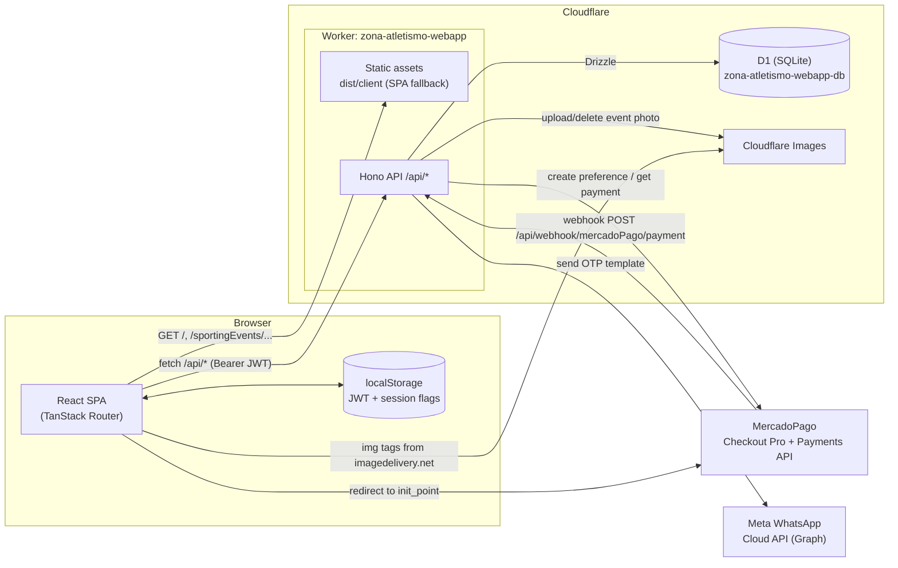
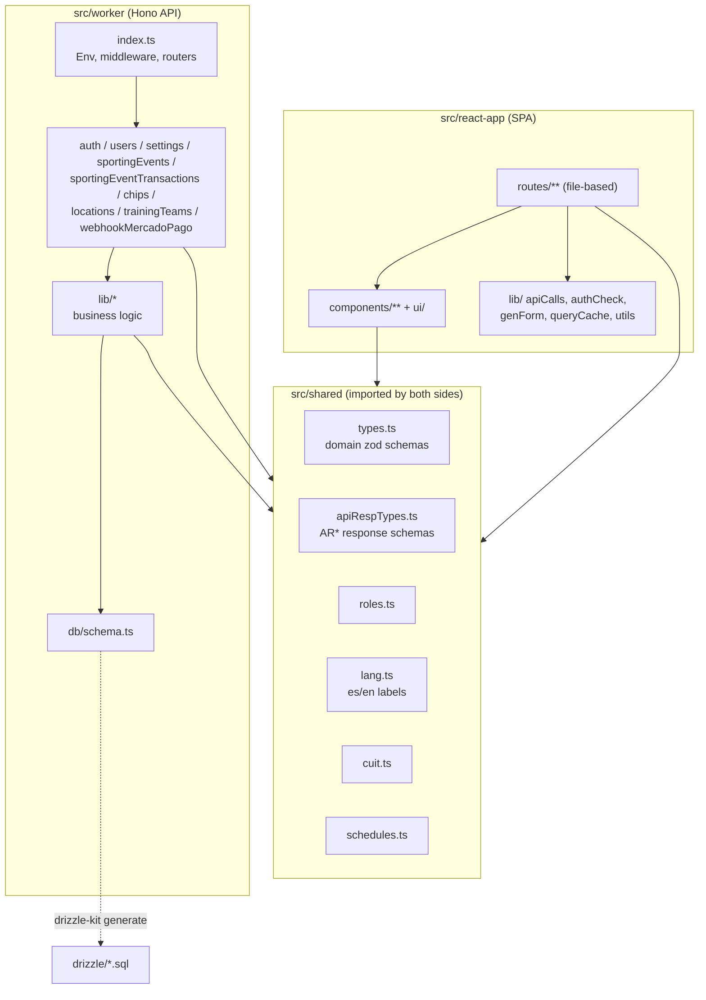
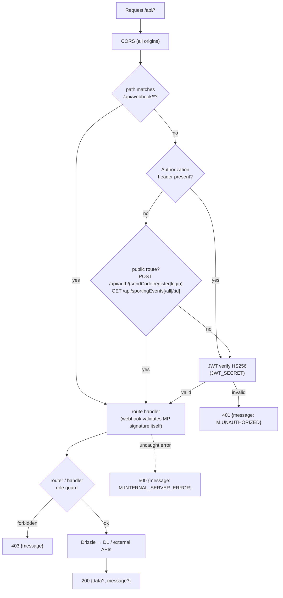
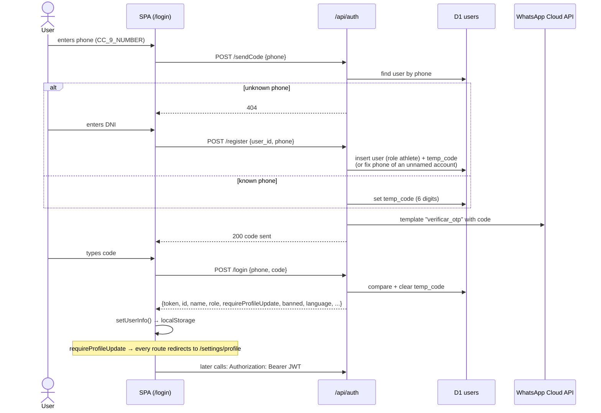
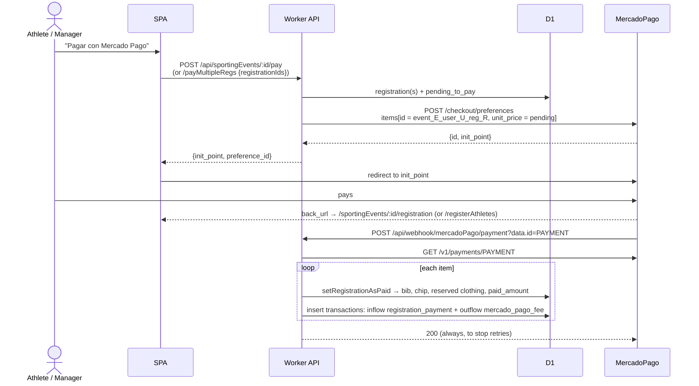
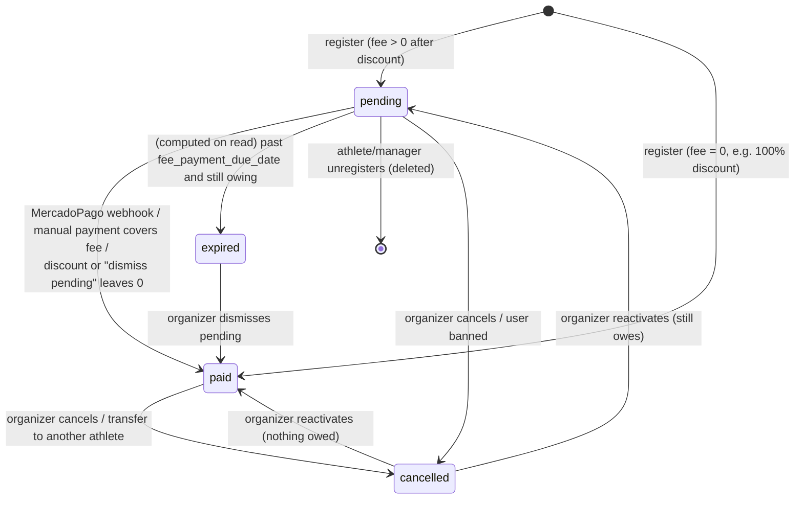

# 02 — Architecture

## System context

A single **Cloudflare Worker** (`zona-atletismo-webapp`) serves two things:

- the built React SPA as static assets (`dist/client`, with SPA fallback for unknown paths);
- a **Hono** JSON API under `/api/*`.

The API talks to **Cloudflare D1** through Drizzle ORM and calls three external HTTP APIs.

## Repository layout

Three TypeScript projects (`tsconfig.app.json`, `tsconfig.worker.json`, `tsconfig.node.json`)
share `src/shared` through the `@shared/*` alias. The frontend also uses `@/*` → `src/react-app/*`.

## Build & runtime

- **Dev:** `vite` with `@cloudflare/vite-plugin` runs the Worker in workerd, inside the Vite dev
  server, with a local D1 (`.wrangler/state`), plus HMR for React. `@tanstack/router-plugin`
  regenerates `routeTree.gen.ts`, and `@tailwindcss/vite` compiles Tailwind v4.
- **Build:** `tsc -b && vite build` emits `dist/client` (SPA) and the Worker bundle.
- **Deploy:** `wrangler deploy` uploads the Worker and its assets. `nodejs_compat` is enabled,
  as are observability and source-map uploads. See [04-deployment.md](04-deployment.md).

## Request pipeline (API)

Defined in [src/worker/index.ts](../src/worker/index.ts):

- Authorization works per handler. Routers either add a `.use()` guard for the whole router
  (users, chips, transactions, locations writes) or check `authorizedOrg` / `authorizedAthMan`
  in each route.
- Anonymous GETs on event endpoints work because the JWT middleware is skipped when there is no
  header. If a header is present, it must be valid. That is how a logged-in user on the same URL
  also gets `user_registration_status`.

## Authentication flow (WhatsApp OTP + JWT)

- The JWT payload is `{id, phone, role, name, surname, manager_id}`. It has **no expiry**, see
  [12-known-issues.md](12-known-issues.md).
- Pages that call `checkUpdates()` (home and event page) also call `GET /api/settings/updates`.
  That call refreshes the ban flag, and it forces a logout if the role stored in the DB differs
  from the role in the JWT.

## Payment flow (MercadoPago Checkout Pro)

Bank transfers skip all of this. The organizer records a `registration_payment` transaction from
the registrations admin page, and that recomputes `paid_amount` and marks the registration paid
once it is fully covered. Details: [09-business-rules.md](09-business-rules.md#payments).

## Registration lifecycle

- `expired` is not stored in the DB. It is derived when a registration is read.
- `not_registered` is a virtual status used by the UI for users without a registration.

## Shared validation layer

The same zod schemas validate on both sides:

- [src/shared/types.ts](../src/shared/types.ts) contains the domain schemas (`UserSchema`,
  `SportingEventSchema`, …) with Spanish error messages. Frontend forms use them as TanStack Form
  validators, and the API validates request bodies with them.
- [src/shared/apiRespTypes.ts](../src/shared/apiRespTypes.ts) contains the `AR*` ("API Response")
  schemas. They coerce the DB representation (ISO strings → `Date`, `0/1` → boolean) and pick the
  fields each endpoint returns. Loaders parse responses with them, so a shape mismatch fails in
  the loader rather than in a component.

## Planned: scheduled jobs and queues

Background work (cleanups, status updates, WhatsApp notifications) is planned on Cloudflare Cron
Triggers + Queues and is not implemented yet. See [05-tech-stack.md](05-tech-stack.md#planned).
