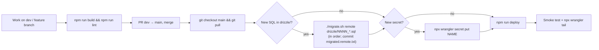

# 04 — Deployment

Production runs as the Worker **`zona-atletismo-webapp`** with the D1 database
**`zona-atletismo-webapp-db`**, both configured in [wrangler.json](../wrangler.json). It is served
at `https://zonaatletismo.com.ar`, the custom domain/route configured in the Cloudflare dashboard.

Deploys are **manual**. Git integration and CI are not set up.

## Release checklist



1. **Build and lint locally.** `npm run check` also does a deploy dry-run.
2. **Merge to `main`** and deploy from an up-to-date `main` checkout.
3. **Run remote migrations first**, for any SQL file not yet listed in
   [migrated.remote.txt](../migrated.remote.txt):
   ```bash
   ./migrate.sh remote drizzle/0009_some_change.sql
   git add migrated.remote.txt && git commit -m "migrated remote db"
   ```
   Migrations should be backward compatible with the running code (add columns, don't drop them
   in the same release). There is no automatic rollback for D1 changes; see
   [Rollback](#rollback).
4. **Deploy:**
   ```bash
   npx wrangler login     # once per machine
   npm run deploy         # = npm run build && wrangler deploy
   ```
5. **Smoke test** the home page, the login code, an event page and an organizer page. Watch the
   logs with `npx wrangler tail`.

## Configuration in production

| Name | Kind | How to set |
|---|---|---|
| `DB` | D1 binding | `wrangler.json` → `d1_databases` |
| `BASE_URL` | plain var | `wrangler.json` → `vars` (`https://zonaatletismo.com.ar`) |
| `JWT_SECRET` | secret | `npx wrangler secret put JWT_SECRET` |
| `GRAPH_API_TOKEN`, `GRAPH_API_PHONE_NUMBER_ID` | secrets | `wrangler secret put …` |
| `MERCADOPAGO_ACCESS_TOKEN`, `MERCADOPAGO_SECRET_KEY` | secrets | `wrangler secret put …` (production credentials) |
| `CLOUDFLARE_ACCOUNT_ID`, `CLOUDFLARE_IMAGES_API_TOKEN` | secrets | `wrangler secret put …` |

Run `npx wrangler secret list` to see which secrets are set. Changing `JWT_SECRET` invalidates
every session, and all users must log in again.

Changing the MercadoPago account that receives payments needs new API credentials in these
secrets plus a redeploy. The event form's tooltip says the same. The bank alias, by contrast, is
per event and is edited in the UI.

## External service setup

### MercadoPago webhook

The checkout preference does **not** send a `notification_url`; that line is commented out in
`src/worker/sportingEvents.ts`. Notifications must therefore be configured in the MercadoPago
developer dashboard for the production application:

- **URL:** `https://zonaatletismo.com.ar/api/webhook/mercadoPago/payment`
- **Events:** Payments
- Copy the **secret signature key** into `MERCADOPAGO_SECRET_KEY`.

The handler fetches `GET /v1/payments/{id}`, marks every item's registration as paid, and records
the transactions. It always returns 200. Signature validation is computed and logged but **not
enforced** yet (see [12-known-issues.md](12-known-issues.md)).

### WhatsApp (Meta Cloud API)

- A WhatsApp Business phone number (`GRAPH_API_PHONE_NUMBER_ID`) and a permanent system-user
  token (`GRAPH_API_TOKEN`).
- An approved message template named **`verificar_otp`** (language `es`): one body variable (the
  code) and one URL button whose payload is the code. The code calls Graph API `v24.0`.

### Cloudflare Images

The API token needs *Images: Edit* on the account. Images are served from
`imagedelivery.net/<account hash>/<photo_id>/public`; the account hash is hard-coded in the
frontend components that render event photos.

## Observability

`wrangler.json` enables `observability` (Workers Logs) and `upload_source_maps`. Errors caught by
`app.onError` are logged as `[Error] METHOD URL`. Webhook processing logs its validation details.

- Live: `npx wrangler tail`
- History: Cloudflare dashboard → Workers → zona-atletismo-webapp → Logs.

## Rollback

- **Code:** in the Cloudflare dashboard (Workers → Deployments), roll back to a previous version,
  or run `npx wrangler rollback`. You can also check out the previous commit and run
  `npm run deploy`.
- **Database:** D1 Time Travel can restore the database to a point in time:
  `npx wrangler d1 time-travel restore zona-atletismo-webapp-db --timestamp=<ISO>`.
  This also discards data written after that time (registrations, payments), so prefer a
  forward-fix migration.
