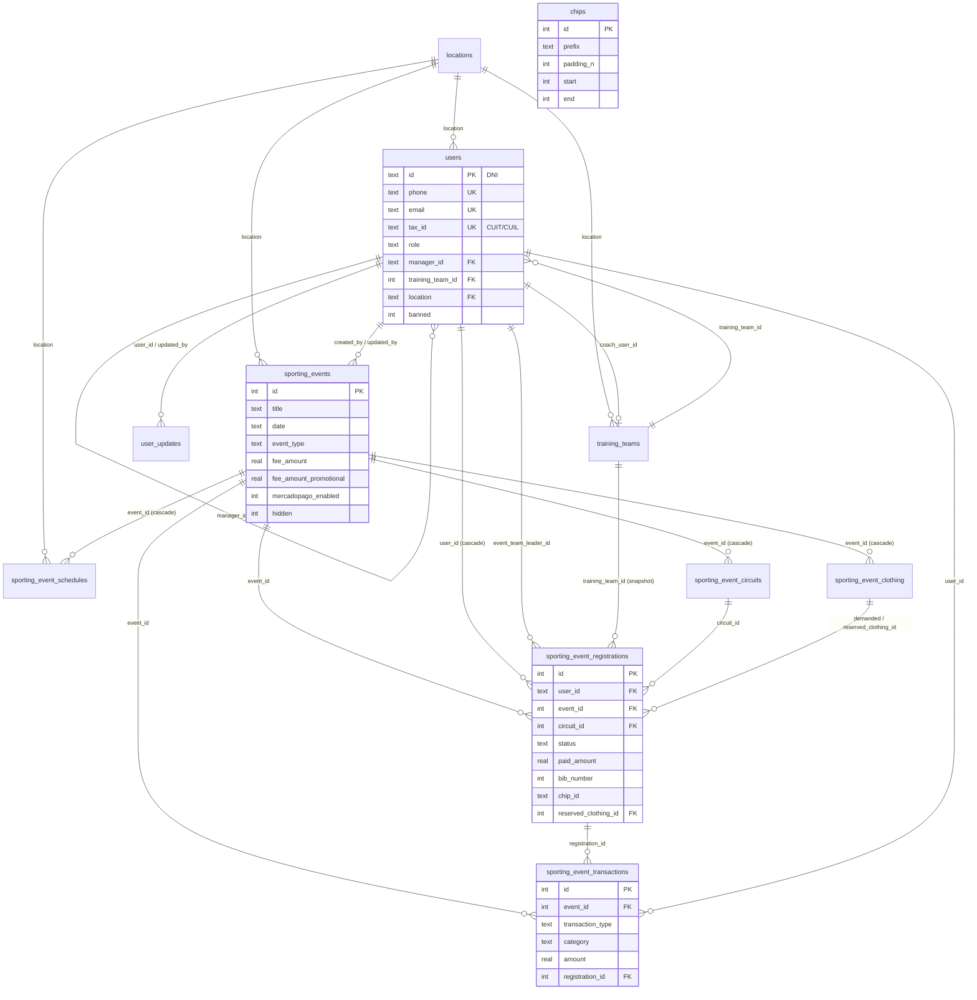

# 06 — Data model

Source of truth: [src/worker/db/schema.ts](../src/worker/db/schema.ts) (Drizzle, SQLite/D1).
Hand-written indexes live in `drizzle/*_z_indexes.sql`. There are 11 tables.

## Conventions

| Convention | Detail |
|---|---|
| Booleans | `integer` 0/1 (`hidden`, `banned`, `competitive`, `teams_enabled`, `registration_disabled`, `mercadopago_enabled`, `promotional_fee_applied`, `kit_delivered`). The API's zod schemas coerce them to booleans |
| Dates/times | `text` ISO-8601 strings (`new Date().toISOString()`). Defaults are `CURRENT_TIMESTAMP`, which has a different format (`YYYY-MM-DD HH:MM:SS`); both parse with `new Date()` |
| `created_at`/`updated_at`/`*_by` | Set by hand in code on update (there are no triggers) |
| User PK | `users.id` = DNI as text (7–28 chars). FKs to users are `ON UPDATE CASCADE`, so the DNI can change |
| Location PK | `locations.id` = `"Locality, Province, Country"` |
| Sentinels | `users.location = 'temporary_location'` (with `location_temp` text); `users.training_team_temp` (text with `training_team_id` null); clothing size `'N/A'` = no shirt |
| Money | `real`, currency `ARS` by default |

## Entity-relationship diagram

`chips` has no foreign keys. Chip ids in registrations are plain strings derived from the ranges.

## Tables

### `users`

| Column | Type | Notes |
|---|---|---|
| `id` | text(28) PK | DNI |
| `name`, `surname` | text | Null until the profile is completed. A user with `name IS NULL` counts as "registration in progress"; `/auth/register` may then rewrite the phone |
| `phone` | text, unique | Format `CC_9_NNNNNNNNNN`, e.g. `54_9_3400123456`. Login identifier |
| `email` | text, unique | |
| `emergency_contact_name`, `emergency_contact_phone` | text | |
| `sex` | text(1) | `M` / `F` (used in categories) |
| `date_of_birth` | text | ISO date (minimum age 5) |
| `clothing_shirt_size` | text(8) | `XS`…`XXXL`. Required to register for events |
| `location` | text FK → locations | Or `temporary_location` |
| `location_temp` | text | Free text, pending organizer review |
| `location_address` | text | Street address |
| `special_needs` | text(512) | Accessibility/medical. Only organizers can edit it |
| `tax_id` | text(13) | CUIT/CUIL `XX-XXXXXXXX-X`. Partial unique index. Only organizers can edit it |
| `discount_percentage` | int, default 0 | Copied into each new registration |
| `manager_id` | text FK → users | The athletes manager responsible for this user |
| `training_team_id` | int FK → training_teams | |
| `training_team_temp` | text(128) | Free-text team, pending review |
| `profile_photo_id` | text | Reserved (unused) |
| `banned`, `ban_reason` | int, text | See [09](09-business-rules.md#bans) |
| `language` | text(2), default `es` | Language for API messages |
| `temp_code` | text(6) | Current login OTP (cleared on successful login) |
| `role` | text | `admin` \| `organizer` \| `athletes_manager` \| `athlete` |
| `created_at`, `updated_at` | text | |

Indexes: partial unique on `phone`, `email` and `tax_id` (`WHERE … IS NOT NULL`), plus `(id, role)`.

A **complete profile** needs name, surname, phone, email, emergency contact name and phone, sex,
date of birth, shirt size, location (or `location_temp`) and address. Login returns
`requireProfileUpdate = true` if any of these is missing.

### `user_updates`

Audit log of sensitive profile changes (currently phone and email, written by
`POST /api/settings`). Columns: `user_id`, `field_name`, `old_value`, `new_value`, `updated_at`,
`updated_by`. The schema comment describes the intended retention: keep 30 days, but always keep
the last 3 entries per field. That cleanup is not implemented yet (planned cron job).

### `locations`

`id` (text PK, `"Locality, Province, Country"`), `locality`, `province`, `country`, `latitude`,
`longitude`. Updating the location id cascades to referencing rows.

### `training_teams`

`id`, `name`, `location` → locations, `coach_name`, `coach_user_id` → users, `contact_email`,
`contact_phone`, timestamps.

### `chips`

Timing-chip **segments**: `prefix` (≤8 chars, stored uppercase), `padding_n` (number of digits),
`start`, `end` (inclusive). Example: `CH`, 5, 300, 500 → `CH00300` … `CH00500`. Segments with the
same prefix and padding must not overlap. The table is global (not per event). Index on
`(prefix, padding_n)`.

### `sporting_events`

| Column | Notes |
|---|---|
| `title`, `description`, `event_type` | Type: `marathon`, `half_marathon`, `duathlon`, `triathlon`, `trail`, `cycling`, `swimming`, `other` |
| `photo_id` | Cloudflare Images id of the cover |
| `date` | Event date (ISO) |
| `registration_start`, `registration_end` | Self-service registration window |
| `location`, `location_address`, `location_lat`, `location_long` | |
| `rules`, `disclaimer_of_liability`, `award_prizes` | Long text |
| `mercadopago_enabled` | 0/1. Enables the online payment buttons |
| `bank_alias` | Transfer alias shown to athletes |
| `fee_amount`, `fee_currency` (ARS), `fee_payment_due_date` | Regular fee. Registration is blocked while `fee_amount` is null |
| `fee_amount_promotional`, `promotional_fee_end`, `promotional_fee_payment_due_date` | Early-bird fee: register before `promotional_fee_end`, pay before the promotional due date |
| `age_ranges` | e.g. `"18,30,40,50"` (see categories) |
| `external_register_url` | Optional external form (e.g. Google Forms) |
| `results_url` | Results link shown after the event |
| `hidden` | 0/1. Draft: only organizers can see it |
| `created_by`, `updated_by`, timestamps | |

### `sporting_event_circuits`

`event_id` (cascade delete), `name`, `description`, `distance_km`, `map_url`,
`competitive` (default 1), `bib_number_start`, `bib_number_end`, `teams_enabled` (default 0),
`registration_disabled` (default 0; blocks new self-service registrations to this circuit;
organizers can still register athletes).

### `sporting_event_schedules`

Event milestones ("cronograma"): `event_id` (cascade), `date_start`, `date_end`, `title`,
`description`, `location`, `location_address`, `location_lat`, `location_long`,
`notification_template_id` and `notify_at`. The last two are reserved for planned notifications.

### `sporting_event_clothing`

One row per event × clothing type × size: `clothing_type` (`tshirt` | `tanktop`), `size`
(`XS`…`XXXL` or `N/A`), `purchased_quantity` (stock bought). Demanded and reserved counts are
computed from registrations.

### `sporting_event_registrations`

| Column | Notes |
|---|---|
| `user_id` | FK, cascade delete with the user |
| `event_id`, `circuit_id` | |
| `training_team_id` | Snapshot of the user's team when they registered |
| `age_at_event_date` | Computed when they registered |
| `discount_percentage`, `discount_reason` | Copied from the user; organizers can change them |
| `registration_date` | default now |
| `promotional_fee_applied` | 1 if registered while the promotion was active |
| `paid_amount` | Sum paid so far |
| `status` | `pending` \| `paid` \| `cancelled` (stored). `expired` is computed; `not_registered` is virtual |
| `full_payment_date` | When it became `paid` |
| `demanded_clothing_id` | Clothing row matching the user's shirt size |
| `reserved_clothing_id` | Clothing actually reserved from stock (set on payment if available) |
| `chip_id`, `bib_number` | Assigned on payment |
| `event_team_leader_id` | Event team link (both members point to the leader's user id) |
| `kit_delivered` | 0/1 |
| `created_*`, `updated_*` | |

Index: partial unique on `(event_id, bib_number, chip_id)` when both are non-null. There is no
DB-level uniqueness on `(user_id, event_id)`; the code prevents duplicates.

### `sporting_event_transactions`

Per-event ledger.

| Column | Notes |
|---|---|
| `event_id` | |
| `transaction_type` | `inflow` \| `outflow`. Derived from the category (`TransactionTypeByCategory` in `src/shared/types.ts`) |
| `category` | inflow: `registration_payment`, `sponsorship`, `other_inflow`. Outflow: `registration_refund`, `mercado_pago_fee`, `infrastructure`, `marketing`, `prizes`, `clothing`, `permits`, `equipment`, `partner_services`, `other_outflow` |
| `amount` | Always positive; the type gives the sign |
| `currency` | default `ARS` |
| `description`, `vendor_supplier`, `receipt_url` | |
| `transaction_date` | |
| `user_id`, `registration_id` | Set for registration payments (the user is derived from the registration) |
| `payment_method` | `cash` \| `bank_transfer` \| `mercado_pago_checkout_pro` \| `other` |
| `status` | `pending` \| `completed` \| `failed` \| `cancelled`. Only `completed` `registration_payment` rows count toward `paid_amount` |
| `created_*`, `updated_*` | |

## Shared enumerations (zod)

Defined in [src/shared/types.ts](../src/shared/types.ts). Spanish and English labels are in
[src/shared/lang.ts](../src/shared/lang.ts).

| Enum | Values |
|---|---|
| Roles | `admin`, `organizer`, `athletes_manager`, `athlete` |
| Event types | `marathon`, `half_marathon`, `duathlon`, `triathlon`, `trail`, `cycling`, `swimming`, `other` |
| Registration status | `not_registered`, `pending`, `paid`, `expired`, `cancelled` |
| Clothing types | `tshirt`, `tanktop` |
| Shirt sizes | `XS`, `S`, `M`, `L`, `XL`, `XXL`, `XXXL` (+ `N/A`) |
| Schedule template ids | `kits_delivery`, `promotional_payment_deadline`, `regular_payment_deadline`, `last_minute_payment_deadline`, `event_day` |
| Transaction type / category / method / status | see the transactions table above |
