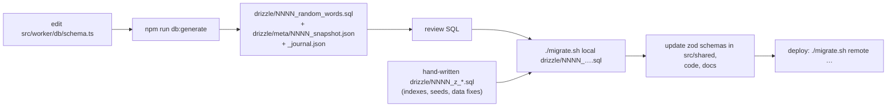

# 07 — Migrations & seeding

## How migrations work here

The schema is defined in TypeScript, [src/worker/db/schema.ts](../src/worker/db/schema.ts).
**drizzle-kit** diffs it against the last snapshot in `drizzle/meta/` and writes a SQL file.
Applying migrations is done by **[migrate.sh](../migrate.sh)**, one file at a time. It does not
use `wrangler d1 migrations apply`, so D1's own migrations table is not used.



Configuration ([drizzle.config.json](../drizzle.config.json)):

```json
{ "out": "./drizzle", "schema": "./src/worker/db/schema.ts", "dialect": "sqlite" }
```

### File kinds

| Pattern | Origin | Content |
|---|---|---|
| `drizzle/NNNN_<adjective>_<name>.sql` | generated | DDL. Statements are separated by `--> statement-breakpoint` |
| `drizzle/meta/NNNN_snapshot.json`, `_journal.json` | generated | drizzle-kit state. Never edit by hand |
| `drizzle/NNNN_z_<name>.sql` | hand-written | Partial unique indexes and seed data. The `z` makes the file sort after the generated migration with the same number |

### Current migrations

| File | Change |
|---|---|
| `0000_needy_quentin_quire.sql` | Initial schema (all tables) |
| `0000_z_indexes.sql` | Partial unique indexes on `users.phone` and `users.email`; `(id, role)` index; unique `(event_id, bib_number, chip_id)`; `chips(prefix, padding_n)` index |
| `0000_z_initial_prod_data.sql` | **Production seed**: base localities, training team #1, organizer and admin users |
| `0000_z_initial_test_data.sql` | **Local seed**: localities with coordinates, 2 training teams, users, sample events, circuits, schedules and clothing |
| `0001_tiresome_harrier.sql` | `registrations.event_team_leader_id`; `sporting_events.mercadopago_enabled`, `bank_alias` |
| `0002_rapid_screwball.sql` | `circuits.teams_enabled` |
| `0003_black_clea.sql` | `schedules.date` renamed to `date_start`; adds `date_end` |
| `0004_fast_kid_colt.sql` | `sporting_events.external_register_url` |
| `0005_giant_network.sql` | Table rebuild of `sporting_events`: `rules` widened to 16384 chars, `disclaimer_of_liability` to 8192 |
| `0006_glamorous_tinkerer.sql` | Table rebuild of `user_updates` (`updated_by` nullable) |
| `0007_zippy_whistler.sql` | `circuits.registration_disabled` |
| `0008_luxuriant_doctor_strange.sql` | `users.tax_id` |
| `0008_z_indexes.sql` | Partial unique index on `users.tax_id` |

## `migrate.sh`

```bash
./migrate.sh local  drizzle/<file>.sql
./migrate.sh remote drizzle/<file>.sql
```

What the script does:

- It checks that the first argument is `local` or `remote` and that the path starts with
  `drizzle/`.
- If the path is already listed in `migrated.<env>.txt`, it prints "already applied" and exits 0.
- It runs `npx wrangler d1 execute zona-atletismo-webapp-db --<env> --file=./<file>`.
- On success it appends the path to `migrated.<env>.txt`.

`migrated.remote.txt` is **committed**; it is the record of what production has.
`migrated.local.txt` is gitignored.

## Apply order

Apply files in filename order, choosing **one** seed:

1. `0000_needy_quentin_quire.sql`
2. `0000_z_indexes.sql`
3. **Seed:** `0000_z_initial_test_data.sql` (local) **or** `0000_z_initial_prod_data.sql` (a
   brand-new production DB)
4. `0001_…` through `0008_…`, then `0008_z_indexes.sql`

The test seed must run **before `0003`**: it inserts schedules into the column `date`, which
`0003` renames to `date_start`. Running it later fails. In general, a seed is written against the
schema at its own number.

A copy-paste loop for local setup is in
[03-development.md](03-development.md#3-create-and-seed-the-local-database).

## Writing a new migration

1. Change `src/worker/db/schema.ts`. Follow the existing style: `text({ length })`, `int()`,
   `real()`, `.default(sql\`CURRENT_TIMESTAMP\`)` for timestamps, and FKs with
   `onDelete`/`onUpdate` set explicitly (`set null` + `cascade` is the norm).
2. Run `npm run db:generate`. A new `drizzle/0009_<words>.sql` appears.
3. Review it. Adding a column is a simple `ALTER TABLE … ADD`. Changing a column's type, nullability
   or FK makes drizzle-kit emit a **table rebuild** (`PRAGMA foreign_keys=OFF; CREATE __new_x; INSERT
   SELECT; DROP; RENAME`), which needs careful review.
4. If you need a partial unique index (unique only when non-null) or a data backfill, write
   `drizzle/0009_z_<name>.sql` by hand.
5. Apply locally: `./migrate.sh local drizzle/0009_<words>.sql` (and the `_z_` file).
6. Update the zod schemas (`src/shared/types.ts`, `apiRespTypes.ts`), the affected queries, and
   [06-data-model.md](06-data-model.md).
7. During the release, apply it to remote **before** deploying code that depends on it
   ([04-deployment.md](04-deployment.md)).

## Seeders

### Production seed (`0000_z_initial_prod_data.sql`)

Inserts the base localities of the region (Villa Constitución, Empalme, San Nicolás, Rosario,
Arroyo Seco, …), the training team "SM Atletismo", and the initial staff accounts: two
organizers and one admin. Only use it for a brand-new production database. It contains real
contact data (see [12-known-issues.md](12-known-issues.md)).

### Test seed (`0000_z_initial_test_data.sql`)

Same localities with lat/long, two training teams (one "TEST GROUP"), fake users with every role,
several sample `sporting_events` with circuits, three schedule items and t-shirt stock for event
6. Use it for local development.

### Fake data generator

[gen_test_data/main.py](../gen_test_data/main.py) uses Faker (`es_ES`) to create realistic users:

- Random DNI (20–45 million) and phone `54_9_XXXXXXXXXX`; email derived from the name.
- Shirt sizes normally distributed around M/L; birth dates for ages 10–80.
- 5% get a temporary location, 0.5% have special needs (with a 100% discount), 10% are
  athletes managers, and about 10% of athletes are assigned a manager.
- 30% have no training team; 10% of those get a temporary team name. The rest get team ids 1–10,
  so those training teams **must exist**.

```bash
cd gen_test_data
echo 0 > last.txt            # counter file, not committed; create it once
uv run main.py               # or: pip install faker && python main.py
# → insert_users_1.sql (N = 250 users; change N in main.py)
cd ..
npx wrangler d1 execute zona-atletismo-webapp-db --local --file=gen_test_data/insert_users_1.sql
```

The output reflects the current `users` columns at the time the script was written. If you add
NOT NULL columns without defaults, update `generate_sql()`.
